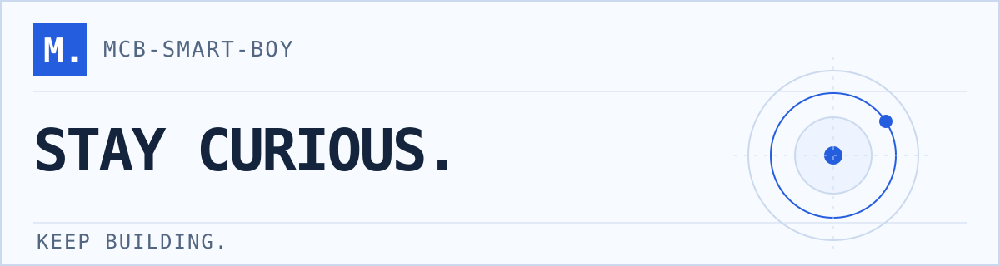
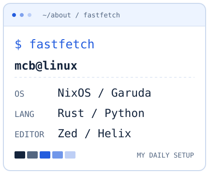
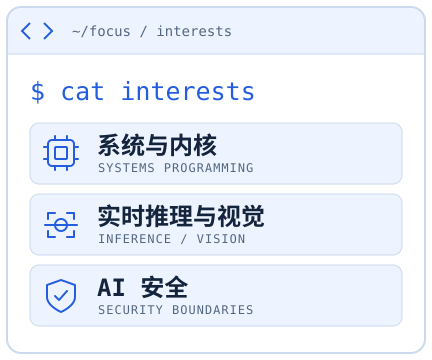

  <picture>
    <source media="(prefers-color-scheme: dark)" srcset=".github/assets/profile-dark.svg">
    <source media="(prefers-color-scheme: light)" srcset=".github/assets/profile-light.svg">
    
  </picture>

  <strong>把好奇心写成代码。</strong> 
  你好，我是 MCB。喜欢从代码追到系统，弄清抽象之下发生了什么。 
  用 Rust 和 Python 探索问题，在 Linux 上学习、构建和记录。

  <picture>
    <source media="(prefers-color-scheme: dark)" srcset=".github/assets/profile-tools-dark.svg">
    <source media="(prefers-color-scheme: light)" srcset=".github/assets/profile-tools-light.svg">
    
  </picture>

  <picture>
    <source media="(prefers-color-scheme: dark)" srcset=".github/assets/profile-terminal-dark.svg">
    <source media="(prefers-color-scheme: light)" srcset=".github/assets/profile-terminal-light.svg">
    
  </picture>
  <picture>
    <source media="(prefers-color-scheme: dark)" srcset=".github/assets/profile-focus-dark.svg">
    <source media="(prefers-color-scheme: light)" srcset=".github/assets/profile-focus-light.svg">
    
  </picture>

  <samp>learn(); build(); repeat();</samp> 
  <a href="https://github.com/MCB-SMART-BOY?tab=repositories">查看我的代码 ↗</a>

